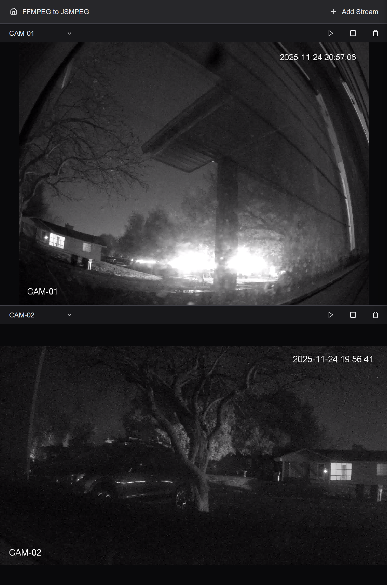
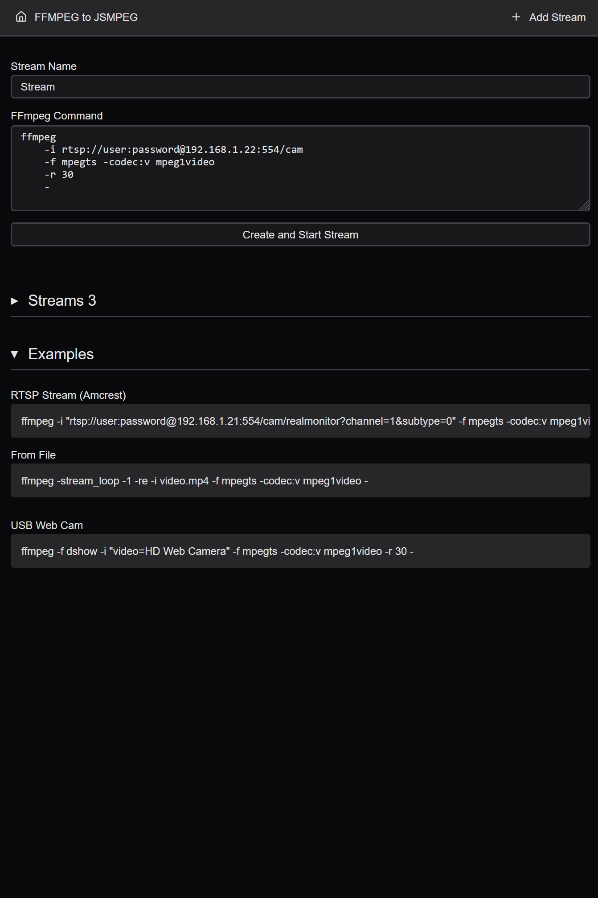

# RTSP to WebSocket

> Must have FFmpeg installed if not using Docker

Take in a RTSP stream available on the network and restream it as a WebSocket stream to be received by jsmpeg in the browser

Server: RTSP stream (or other input) -> ffmpeg (encode mpeg1video) -> WebSocket stream

Client: WebSocket stream -> jsmpeg (decode) -> Render to HTML Canvas Element
 
See example [FFMPEG commands](./config/README.md)

## web ui

## Docker

See [Docker Compose](./compose.yaml) and [Docker](./Dockerfile)

## Ideas

- [ ] Add MJPEG streaming and viewer
    - `ffmpeg -i video.mp4 -an -vf scale=640:-1 -r 10 -f mjpeg -q:v 1 -`
- [ ] Add Thumbnail generation every x seconds and viewer
    - `ffmpeg -i video.mp4 -r 1 -update 1 ./public/image/id.png -y`
- [ ] Add WebRTC streaming and viewer
- [ ] Add HLS streaming and viewer

